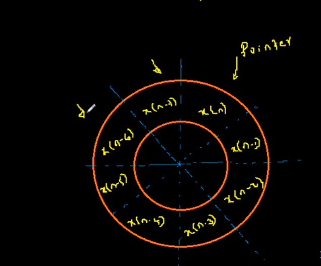
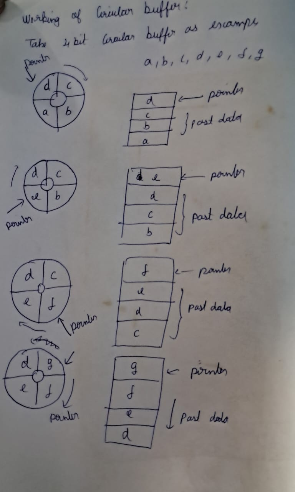
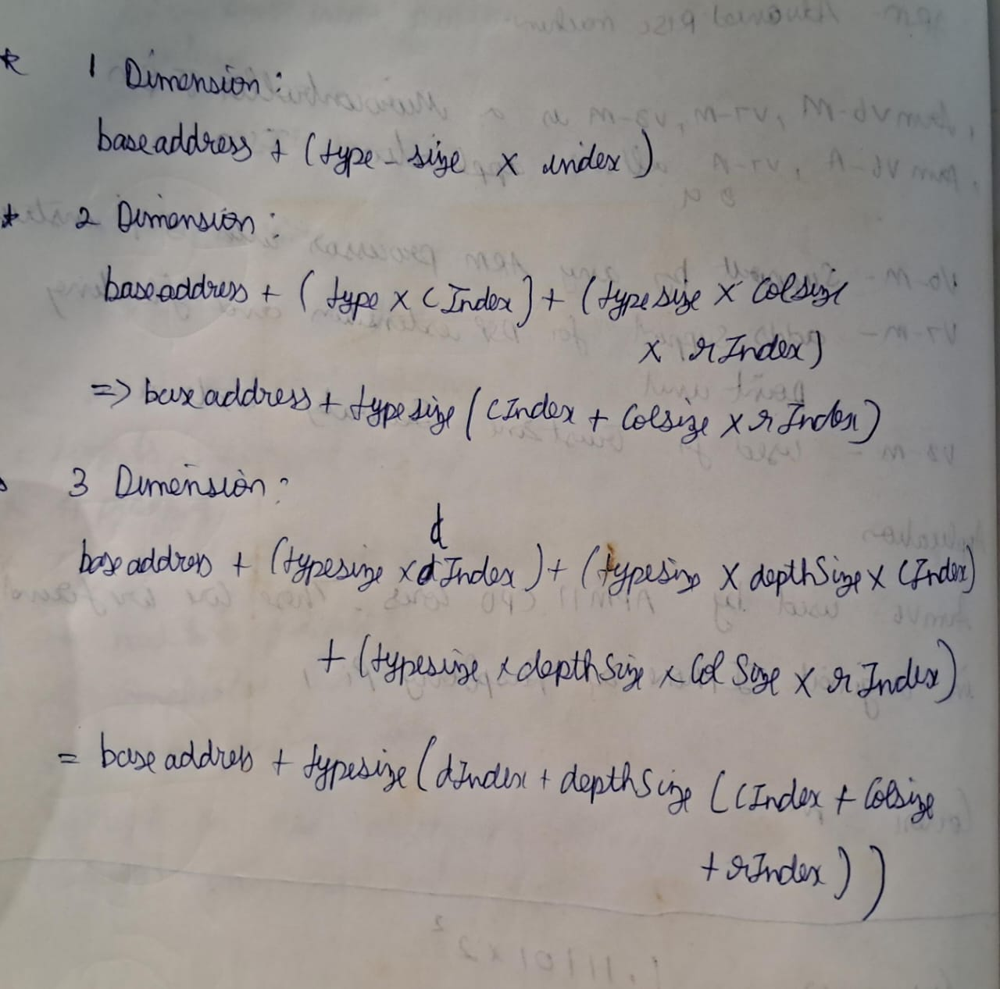
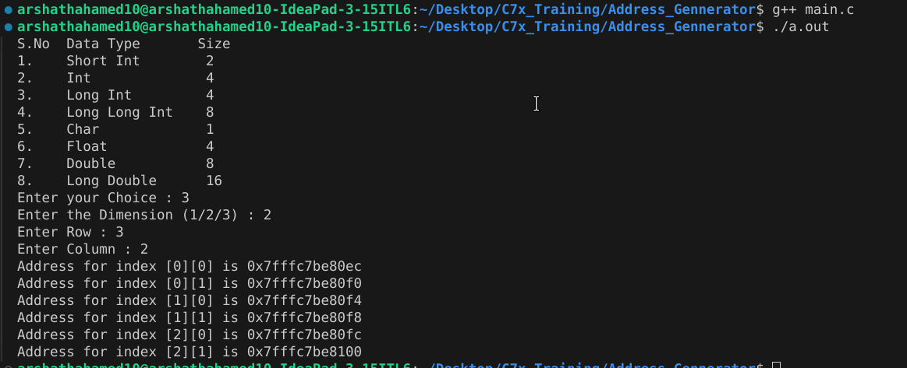

## Resource
* Youtube : [Link](https://www.youtube.com/watch?v=Li1w99teZRw)

## Introduction
* To the data buffer, the DSP processor need to generate address to send the data 
* So that we use Address Generator which is used to generate address for each data
* It is a hardware unit , which we use circular buffer
* Example , we have circular buffer that holds 8 bit data and it is acts like a FIFO buffer and the pointer is pointed to the recent data 

## Example

* Code : [Here](./main.c)
* Logic I used

* Output

* India Is 